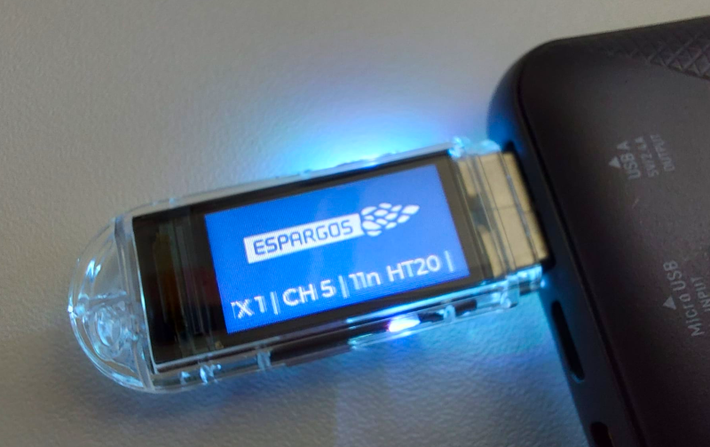

# LILYGO T-Dongle-C5 ESPARGOS Test Transmitter



This repository contains the source code for a Wi-Fi test transmitter running on
a [LILYGO T-Dongle-C5](https://lilygo.cc/en-us/products/t-dongle-c5).
It is intended for experiments with [ESPARGOS](https://espargos.net/) and transmits
configurable 802.11 frames that can be used as known test signals for channel
measurement experiments. You can plug the T-Dongle-C5 into a power bank and use
that as a portable test transmitter.

The firmware is built with ESP-IDF for the ESP32-C5. It uses the T-Dongle-C5
display, button, and RGB LED.
The transmitter's parameters can be modified with the builtin configuration menu
to make the transmitter configurable without a serial console once it
has been flashed.

## Features

- Sends broadcast 802.11 data frames at a configurable interval.
- The firmware does not join an access point or act as one.
- Supports 802.11b, 802.11g, 802.11n HT20, 802.11n HT40, and 802.11ax HE20
  PPDU types.
- Configurable channel, transmitter index, modulation, rate/MCS, packet
  interval, secondary channel for HT40, and transmit power.
- Stores the selected configuration in NVS so it survives reboot.
- Shows the current transmitter configuration on the built-in display.
- Uses the RGB LED color to identify the selected transmitter index.
- Transmitter index is just a method of separating multiple transmitters:
  Each one gets its own MAC address and associated color.

## Hardware

- LILYGO T-Dongle-C5
- USB-C cable for power, flashing, and serial monitor
- ESPARGOS receiver setup for the experiment

## Build and Flash

Install ESP-IDF, then build the project for the ESP32-C5:

```sh
idf.py set-target esp32c5
idf.py build
```

Flash and monitor the device (plug in while button is pressed to enter BOOT mode):

```sh
idf.py -p /dev/ttyACM0 flash monitor
```

Adjust the serial port for your machine.

## Configuration

Defaults can be changed with:

```sh
idf.py menuconfig
```

The transmitter settings are under `CSI transmitter`.

Runtime changes made on the device are saved to NVS. To return to menuconfig
defaults, erase the flash or clear NVS before flashing again.

## Device Controls

The T-Dongle-C5 button controls the on-device menu:

- Short press from the home screen: open the setup menu.
- Short press in the setup menu: move to the next setting.
- Long press in the setup menu: edit the selected setting.
- Short press while editing: cycle through values.
- Long press while editing: apply and save the value.

The home screen shows the active transmitter index, channel, modulation, rate,
interval, and transmit power. Serial logs also report the active configuration
and packet counters.

## Note
Due to the quite limited complexity of this firmware, the majority of the source code has been AI-generated.
The functionality has been tested, but not all source code has been manually reviewed.
